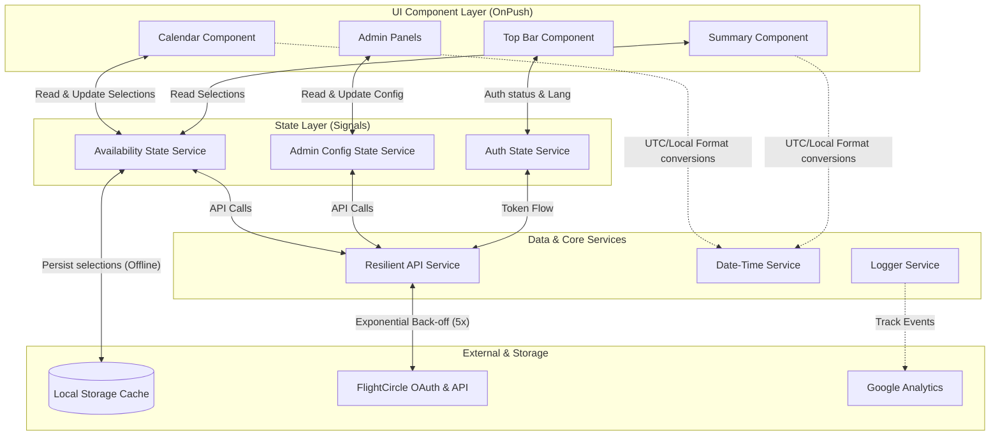
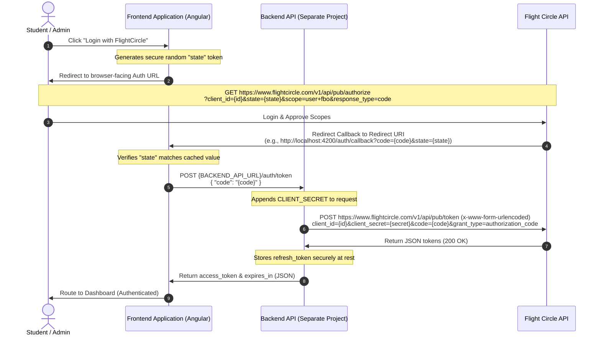

# Aviate Scheduler Frontend Architecture

This document outlines the technical structure, architectural principles, and data flow patterns for the **Aviate Scheduler** frontend application.

The primary objective of this architecture is to build a type-safe, performant, and highly resilient Angular application (v18+) that integrates seamlessly with the FlightCircle API, maintains student selections across sessions, and operates under strict date-time localization rules.

---

## 1. High-Level System Architecture

The frontend application follows a unidirectional data flow pattern powered by **Angular Signals** for state management and an abstracted, resilient **Data Layer** for API communications.



---

## 2. Directory Structure

The application codebase is organized into four main layers inside `src/app/` to enforce separation of concerns and modularity:

```text
src/app/
├── app.config.ts              # Core application providers and bootstrap configs
├── app.routes.ts              # Root routing configurations (Guards-protected)
├── app.ts                     # Root shell component class (Standalone)
├── app.html                   # Root shell template
├── app.scss                   # Root shell styling (Theme and global CSS variables)
├── core/                      # Singleton infrastructure services
│   ├── auth/                  # Authentication & OAuth2 handlers
│   │   ├── auth.service.ts    # Token exchange and renewal management
│   │   ├── auth.guard.ts      # Role-based route guard (Student vs Admin)
│   │   └── auth.interceptor.ts# Appends Bearer token and handles 401s
│   ├── api/                   # Resilient HTTP client wrappers
│   │   └── api.service.ts     # Configures exponential back-off and global error intercepts
│   ├── date-time/             # Specialized Date-Time operations
│   │   └── date-time.service.ts # Core service wrapping date-fns and Intl APIs
│   └── logging/               # Logging & event tracking
│       └── logger.service.ts  # Handles console logs (toggleable) & Google Analytics
├── data/                      # Global Data Layer (Models, State & API wrappers)
│   ├── models/                # Strictly typed domain interfaces (no 'any')
│   │   ├── user.model.ts      # Profile, role, and custom FlightCircle fields
│   │   ├── availability.model.ts # AvailabilitySlot and DefaultAvailability contracts
│   │   └── aircraft.model.ts  # Aircraft details and usage intervals
│   └── services/              # State-bearing services (using Signals)
│       ├── student-availability.service.ts # Manages student availability state & cache
│       ├── admin-config.service.ts         # Manages release month and parameters state
│       └── flight-circle-api.service.ts    # Direct FlightCircle endpoint callers
├── features/                  # Domain-specific feature modules (Standalone components)
│   ├── auth/                  # Login page and OAuth2 callback router
│   │   ├── login/
│   │   └── callback/
│   ├── student/               # Student workspace components
│   │   ├── dashboard/         # Shell student view
│   │   ├── calendar/          # Grid-based weekly calendar (drag/click signals)
│   │   ├── summary/           # Selected slots summary sidebar
│   │   └── default-settings/  # Weekly template editor (Sunday-Saturday)
│   ├── admin/                 # Admin workspace components
│   │   ├── dashboard/         # Shell admin view
│   │   ├── release-manager/   # Month release & notifications configuration
│   │   ├── config-panel/      # Standard briefing/debriefing & flight duration settings
│   │   └── status-tracker/    # Track students pending completion
│   └── layout/                # Main shell frames
│       └── top-bar/           # Navigation, logo, lang switcher, hamburger menu
└── shared/                    # Reusable components, directives, and pipes
    ├── components/            # Shared UI components (loading spinners, custom dialogs)
    ├── directives/            # Utility directives (click-and-hold gestures, touch handlers)
    └── pipes/                 # Localization and formatting helper pipes
```

---

## 3. Data Layer & State Management (Signals-First)

State management in the application is strictly **Signals-First**. RxJS is only used for data-flow streams (such as HTTP calls) and is instantly converted to signals at the edge.

### State-bearing Services Pattern
State-bearing services expose **read-only signals** to components to prevent direct state mutation from the view layer. Internal state is managed via private writable signals.

```typescript
@Injectable({ providedIn: 'root' })
export class StudentAvailabilityService {
  // Writable private signal (Source of truth)
  private readonly _selections = signal<AvailabilitySlot[]>([]);

  // Exposed read-only signal for components
  public readonly selections = this._selections.asReadonly();

  // Computed state for total hours selected
  public readonly totalHoursSelected = computed(() => {
    return this._selections().reduce((total, slot) => total + this.calculateHours(slot), 0);
  });

  // Mutator actions
  public addSlot(slot: AvailabilitySlot): void {
    this._selections.update(prev => [...prev, slot]);
    this.saveToCache();
  }

  public removeSlot(slot: AvailabilitySlot): void {
    this._selections.update(prev => prev.filter(s => !this.isEqual(s, slot)));
    this.saveToCache();
  }

  private saveToCache(): void {
    localStorage.setItem('student_availability_cache', JSON.stringify(this._selections()));
  }
}
```

### LocalStorage Persistence and Caching Strategy
To ensure that student progress is not lost due to accidental tab closures, page reloads, or transient network connectivity drops, the application implements a local persistence caching layer:

1. **State Synchronization:** Writable signals in `StudentAvailabilityService` act as the in-memory source of truth. Any mutations (adding, updating, or removing a slot) automatically trigger a sync operation that serializes the current state into `localStorage` under the key `aviate_availability_draft`.
2. **Session Initialization:** During service instantiation (bootstrap), the constructor checks for the presence of the `aviate_availability_draft` key. If found, it parses the JSON data and initializes the private writable signal with the cached slots.
3. **Draft Cleanup:** Upon successful submission confirmation from the backend API, a confirmation hook triggers a state cleanup. The service resets the writable selections signal and removes the `aviate_availability_draft` key from `localStorage` to avoid stale drafts for subsequent months.
4. **Resiliency to Offline Mode:** If the student confirms availability while offline, the local cache remains intact. The application logs the pending submit action, displays a retry notification, and defers cache clearing until a successful HTTP 200/201 response is received from the backend API.

---

## 4. Component Design & UI Guidelines

All components are implemented with `ChangeDetectionStrategy.OnPush` and standalone declarations, in compliance with the **Zoneless & OnPush** principles.

### Dynamic Interaction API
Components use modern Signal-based inputs, outputs, and two-way model bindings:

```typescript
@Component({
  selector: 'aviate-calendar-slot',
  standalone: true,
  changeDetection: ChangeDetectionStrategy.OnPush,
  imports: [CommonModule],
  templateUrl: './calendar-slot.html',
  styleUrl: './calendar-slot.scss'
})
export class CalendarSlotComponent {
  // Modern Inputs & Outputs
  startTime = input.required<string>(); // ISO date-time string
  endTime = input.required<string>();   // ISO date-time string
  isSelected = model<boolean>(false);   // Two-way signal binding
  
  slotClick = output<void>();

  // Computed state for slot visualization
  displayTime = computed(() => {
    // localized format conversion
  });
}
```

### Modern Control Flow
Angular's modern template control flow block syntax is strictly enforced:
- **Conditionals:** Use `@if / @else` block syntax instead of `*ngIf`.
- **Iterators:** Use `@for` blocks with a performance-optimized `track` parameter instead of `*ngFor`.

### Responsive Layout and Styling
- **Theming:** The core theme is dark navy blue (`#000080`), configured via CSS custom variables in `src/app/app.scss` with support for high-contrast light themes.
- **Responsiveness:** Uses CSS Flexbox, Grid, and Container Queries. For example, on screens smaller than `768px`, the layout shifts dynamically from a side-by-side Calendar/Summary view to a vertical stack.

### Transitions, Animations, and Visual States

To provide a premium and dynamic interface, the application utilizes smooth visual feedback loops for user actions, page transitions, and asynchronous operations.

#### 1. Writable Loading & Submitting States (Signals-Driven)
All asynchronous operations (OAuth2 callback processing, schedule fetching, availability submission) maintain explicit loading signals.
- **Pattern:** Components or services expose read-only signals (e.g., `isLoading = signal(false)`) which are mapped in HTML templates using Angular's `@if` control flow blocks to render loaders/spinners.
- **Example Usage in Templates:**
  ```html
  <button [disabled]="isSubmitting()" (click)="confirmSelection()">
    @if (isSubmitting()) {
      <aviate-spinner size="small"></aviate-spinner>
    } @else {
      <span>Confirm Availability</span>
    }
  </button>
  ```

#### 2. Smooth Transitions & Micro-animations
Animations are configured for key components using hardware-accelerated CSS properties (`transform`, `opacity`) to avoid layout recalculations and repaints.
- **Hamburger Menu / Drawer:** Slides in from the side using standard CSS transitions.
  - Offscreen: `transform: translateX(100%); opacity: 0;`
  - Active: `transform: translateX(0); opacity: 1;`
  - Timing: `cubic-bezier(0.16, 1, 0.3, 1)` with a 300ms duration for a sleek "springy" entrance.
- **Calendar Selections:** Smooth HSL color fills when dragging or clicking. Slot boxes use a `150ms ease-out` transition on background colors.
- **Modal Dialogs:** Modals fade and scale into view to create a layer-depth effect:
  - Overlay Background: Fades to `rgba(0, 0, 128, 0.4)` (core navy blue tinted overlay).
  - Modal Content Box: Starts at `scale(0.95)` and transitions to `scale(1)` at `200ms ease-out`.

#### 3. Success Feedback ("Green Check" Notification)
Once a student availability selection is successfully confirmed and stored on the backend, a modal showing a "Green Check" visual confirmation displays.
- **Implementation:** The checkmark icon uses SVG animation (`stroke-dasharray` and `stroke-dashoffset` offset keyframes) to draw the checkmark dynamically in 400ms:
  ```css
  .checkmark-path {
    stroke-dasharray: 100;
    stroke-dashoffset: 100;
    animation: drawCheckmark 0.4s ease-in-out forwards;
  }
  @keyframes drawCheckmark {
    to { stroke-dashoffset: 0; }
  }
  ```

---

## 5. API Resiliency & Interceptor Layer

To ensure robustness against spotty connections and rate limits (FlightCircle limits requests to **100/min**), the API Layer implements resiliency middleware.

### Exponential Back-off Strategy
All API requests made through the centralized `ApiService` wrap the standard Angular `HttpClient` and apply an exponential back-off recovery strategy.
- **Initial Delay:** 1 second
- **Back-off Factor:** 2 (e.g., retries at 1s, 2s, 4s, 8s, 16s)
- **Maximum Retries:** 5

```typescript
// Resiliency operator logic in core/api/api.service.ts
public get<T>(url: string): Observable<T> {
  return this.http.get<T>(url).pipe(
    retry({
      count: 5,
      delay: (error, retryCount) => {
        const backoffDelay = Math.pow(2, retryCount - 1) * 1000;
        this.logger.warn(`API error. Retrying request in ${backoffDelay}ms... (Attempt ${retryCount}/5)`);
        return timer(backoffDelay);
      }
    })
  );
}
```

### OAuth2 Integration & Backend API Project Boundaries

Since the Flight Circle API requires a `client_secret` that must never be exposed to the user's browser, the authentication flow relies on a **Backend API (implemented in a separate project)** as a secure proxy.

#### Credentials Security Boundary
- **Frontend Project:** Does NOT directly store or transmit the `client_secret` in production builds. It reads configuration parameters (such as the Flight Circle `client_id`, target `redirect_uri`, and the `BACKEND_API_URL` endpoint) from the local `.env` environment during local development.
- **Backend API Project (Separate Repository):** Securely holds the actual `client_id` and `client_secret` inside its own environment variables. It exposes endpoints to the frontend to orchestrate authentication.

#### Auth & Token Exchange Flow (Technical Details)

The OAuth2 flow is split between the client's browser, the frontend routing, the backend proxy, and Flight Circle as follows:



##### 1. Authorization Redirect (Frontend to Browser)
- **Endpoint:** `GET https://www.flightcircle.com/v1/api/pub/authorize`
- **Query Parameters:**
  - `client_id` (string, required): The application's Flight Circle identifier.
  - `state` (string, recommended): A unique random CSRF prevention token generated by the frontend.
  - `scope` (string, optional): Space-separated list of scopes. Default is `user`.
  - `response_type` (string, optional): Must be `code`.
- **Behavior:** The user logs in on Flight Circle and approves requested scopes. Upon completion, Flight Circle redirects the browser to the pre-registered redirect URI with query parameters `code` (authorization code) and `state` (matching the parameter passed).

##### 2. Authorization Code Exchange (Frontend to Backend Proxy to Flight Circle)
- **Frontend Action:** Intercepts `code` and `state` on `/auth/callback`, verifies `state` match, and forwards `code` to the Backend API.
- **Backend Request:** `POST https://www.flightcircle.com/v1/api/pub/token`
  - **Content-Type:** `application/x-www-form-urlencoded`
  - **Body Fields:**
    - `client_id` (string, required): Read from Backend env.
    - `client_secret` (string, required): Read from Backend env (never sent to client).
    - `code` (string, required): The authorization code received from the client.
    - `grant_type` (string, optional): `"authorization_code"`.
- **Response Shape (200 OK):**
  ```json
  {
    "access_token": "0253071b6d1cce0d119cc968f6b14ceeecc3bj75",
    "refresh_token": "126f4555b483b5e8fae721b773e02fde941a785u",
    "token_type": "Bearer",
    "expires_in": 3600
  }
  ```
- **Backend Storage Boundary:** The backend stores the `refresh_token` securely (e.g. session cookie, encrypted DB) and returns only `access_token` and `expires_in` to the frontend client.

##### 3. Silent Token Renewal (Frontend to Backend Proxy to Flight Circle)
- **Trigger:** When the frontend detects `access_token` expiration.
- **Backend Request:** `POST https://www.flightcircle.com/v1/api/pub/token`
  - **Content-Type:** `application/x-www-form-urlencoded`
  - **Body Fields:**
    - `client_id` (string, required)
    - `client_secret` (string, required)
    - `refresh_token` (string, required): The stored refresh token.
    - `grant_type` (string, required): `"refresh_token"`
- **Response Shape (200 OK):**
  ```json
  {
    "access_token": "new_access_token_string",
    "token_type": "Bearer",
    "expires_in": 3600
  }
  ```

#### Scope Matrix
Scopes determine operations permitted on behalf of the user:
- `user`: Allows reading the authenticated user's own profile and data. (Required for Student profile setup).
- `fbo`: Read-only access to FBO aviation data (aircraft, schedules, members). (Required for Administrator panels).
- `write`: Create, update, and delete records. (Required for releasing months and updating configurations).

#### Route Access & Login Bootstrap Flow

To guarantee security and correct routing on app start, a set of functional guards protects workspace components:

1. **Root Redirection:** Navigating to `""` (the root domain path) redirects to `/login`.
2. **Login Guard (`loginGuard`):** Protects the `/login` path. If the user is already authenticated:
   - Redirects to `/admin` if the user's role is `ADMINISTRATOR`.
   - Redirects to `/student` if the user's role is `STUDENT`.
   - Otherwise, resolves and permits displaying the `LoginComponent`.
3. **Authentication Guard (`authGuard`):** Protects both the `/student` and `/admin` routes. If a user is not logged in, they are redirected to `/login`.
4. **App Initialization:** On boot, the `AuthService` reads existing sessions from `localStorage` to preserve login states and prevent unnecessary redirects.

---

## 6. Date, Time, and Timestamp Guidelines

To avoid bugs involving time zones, offsets, and daylight savings, date and time calculations are centralized inside `DateTimeService`.

### Strict Policies
1. **ISO 8601 UTC:** All data sent to and received from the FlightCircle API must use UTC format (e.g., `YYYY-MM-DDTHH:mm:ssZ`).
2. **No Custom Strings:** Dates must not be parsed or formatted as manual custom strings (e.g., `date + "/" + month`).
3. **date-fns Library:** All date additions, subtractions, and manipulations must use the immutable `date-fns` library.
4. **Intl.DateTimeFormat API:** Rendering dates and times to the user is done dynamically based on the current active locale (`en-US` or `pt-BR`) using the browser's native `Intl.DateTimeFormat` engine.

---

## 7. Logging, Diagnostic, and Analytics Architecture

The frontend exposes a configuration-backed `LoggerService` to control application debugging in different environments.

- **Console Logger:** Output logs are organized into `debug`, `info`, `warn`, and `error` categories. 
- **Production Mode Toggle:** In production configuration, console logging is disabled globally, unless explicitly enabled via the settings toggle in the Administrator panel.
- **Google Analytics:** The logger intercepts all crucial student actions (e.g., calendar selection, default availability application, submission confirmation) and pushes events to Google Analytics to monitor usage metrics.

---

## 8. Strictly Typed Domain Models

All structures are modeled as TypeScript interfaces or enums. The use of `any` is prohibited to maintain compile-time type-safety.

```typescript
export interface AvailabilitySlot {
  day: string;       // ISO Date format: YYYY-MM-DD
  startTime: string; // Time string format: HH:mm
  endTime: string;   // Time string format: HH:mm
}

export interface TrainingProgram {
  id: string;
  name: string;
}

export interface StudentProfile {
  userId: number;
  firstName: string;
  lastName: string;
  email: string;
  trainingProgram: TrainingProgram;
  timezone: string;
  avatarUrl?: string;
}

export interface AdministratorProfile {
  userId: number;
  firstName: string;
  lastName: string;
  role: 'ADMINISTRATOR';
  timezone: string;
  avatarUrl?: string;
}

---

## 9. Testing Infrastructure

The application features a comprehensive, standalone-friendly testing suite built on **Vitest** and **Angular TestBed** to achieve 95%+ (current: 99.2%+) code coverage.

### 9.1 Test Runner & Environment
- **Default Runner:** Vitest is utilized as the primary test runner through the `@angular/build:unit-test` Angular CLI builder.
- **Config file:** The custom [vitest.config.ts](file:///home/henrique/workspace/scheduler-frontend/vitest.config.ts) enables globals, sets the environment to `jsdom`, and manages code coverage parameters.
- **Exclusions:** Code coverage metrics from `v8` exclude non-JS/TS resource files (`.html`, `.scss`, `.spec.ts`, and routing tables) to calculate exact logic coverage.

### 9.2 Zoneless Async Testing (Mock Timers)
Because Vitest executes test suites in a zoneless-ready environment, Angular's default `fakeAsync` and `tick` helpers are not supported. Asynchronous logic, debounces, and API delays are tested using Vitest's native mock timers:
- **Set Up:** `vi.useFakeTimers()` initializes mock timers before the async code is triggered.
- **Advancement:** `vi.advanceTimersByTime(ms)` steps the system forward to execute scheduled timeouts.
- **Teardown:** `vi.useRealTimers()` restores native timers after each test.

```typescript
it('should handle bypass login delays', () => {
  vi.useFakeTimers();
  component['onBypassLogin']('STUDENT');
  
  vi.advanceTimersByTime(800); // Step through simulated delay

  expect(authServiceSpy.setMockSession).toHaveBeenCalledWith('STUDENT');
  vi.useRealTimers();
});
```

### 9.3 Mock Routing & Dependency Injection Spies
To isolate views and layout frames from actual page redirections, tests inject mocked routing setups:
- **Router Provider:** `provideRouter([])` is supplied in the `TestBed.configureTestingModule` providers.
- **Spies:** The real `Router` dependency is resolved via `TestBed.inject(Router)` and spied on using `vi.spyOn(router, 'navigate').mockImplementation(() => Promise.resolve(true))` to verify navigation calls.

### 9.4 State & Core Service Mocking
- **Signals-First Mocking:** Spies for services like `StudentAvailabilityService` provide mock read-only signals (using `signal(initialValue)`) to prevent DOM rendering engines from failing on missing getters.
- **API Resiliency Verifications:** Tests verify that the exponential back-off pipeline works correctly on network failures by mocking `ApiService` to throw transient errors and testing that it retries 5 times before emitting the final error.
